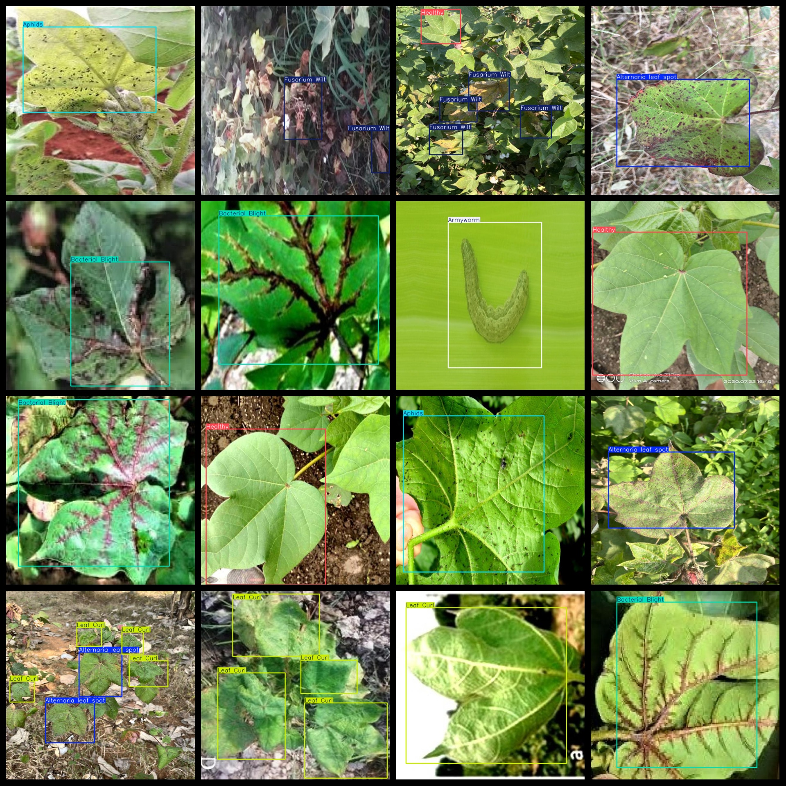
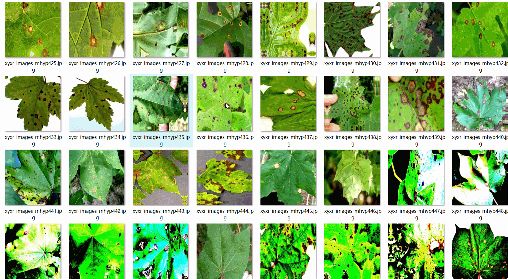

# Cotton Diseases and Pests Detection Dataset 6051 Images 8-Class VOC+YOLO Format

Cotton Diseases and Pests Detection Dataset: 6051 images in 8 classes, VOC+YOLO format.

The dataset format includes both VOC and YOLO formats.

The zip file contains three folders, each storing images, XML files, and TXT files.

In the JPEGImages folder, there are a total of 6051 JPG images.

In the Annotations folder, there are a total of 6051 XML files.

In the labels folder, there are a total of 6051 TXT files.

There are 8 types of labels: ["Alternaria leaf spot", "Aphids", "Armyworm", "Bacterial Blight", "Fusarium Wilt", "Grey milddew", "Healthy", "Leaf Curl"]

The Chinese translation for these labels is provided in the table below:

| Label Name | Chinese Translation |
|------------|-----------------|
Alternaria leaf spot
| Aphids      |  Aphid        |
Armyworm
Bacterial Blight
| Fusarium Wilt | fusarium wilt     |
| Grey mildew | Gray mildew |
| Healthy     | healthy         |
| Leaf Curl     | leaf curl     |

The number of boxes (note that the order of categories in the YOLOF format does not correspond to this, but rather, it is based on the classes.txt file in the labels folder):

- Alternaria leaf spot boxes = 2259
- Aphids boxes = 845
- Armyworm boxes = 852
- Bacterial Blight boxes = 1289
- Fusarium Wilt boxes = 1253
- Grey milddew boxes = 244
- Healthy boxes = 5033
- Leaf Curl boxes = 490

Total boxes: 12265

The image resolutions are all clear.

The images have been enhanced.

The shape of the labels is a rectangular box, used for target detection identification.

Special notice: No guarantee is made regarding the accuracy or weights of models trained with this dataset. The dataset only provides accurate and reasonable annotations.

Annotation and image details are as follows:
## Images

---

Here is a pay link on Stripe (https://buy.stripe.com/3cs8yP7sY87d0vu9AB). Please contact me lonlonago@foxmail.com after funding $89, and I will send you a complete data files, thank you!

